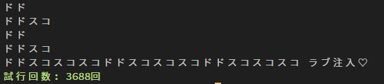

# PHP



## 実行方法

CLI

```sh
php ddsk.php
```

Web

```sh
php -S localhost:5000
curl http://localhost:5000/ddsk-web.php
```

http://localhost:5000/ddsk-web.php

## PHP Sandbox

https://onlinephp.io/c/606e3

## Docker

```sh
docker build . -t ddsk:php
docker run --rm ddsk:php
```